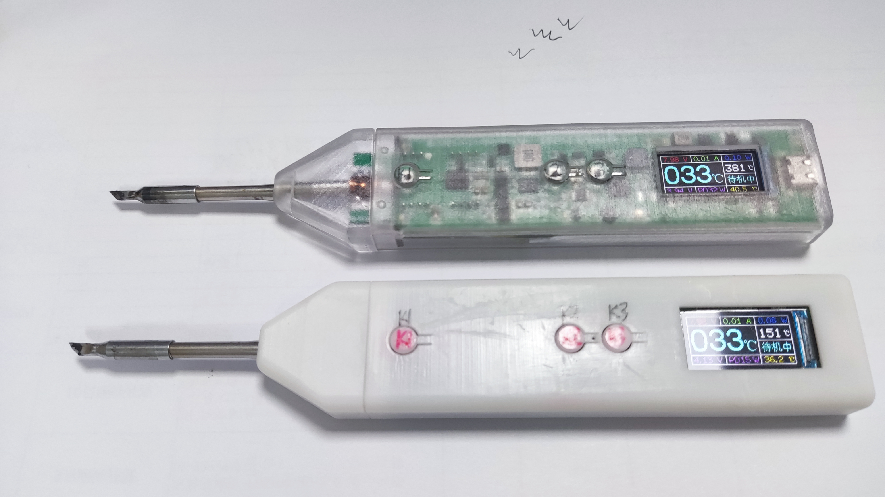
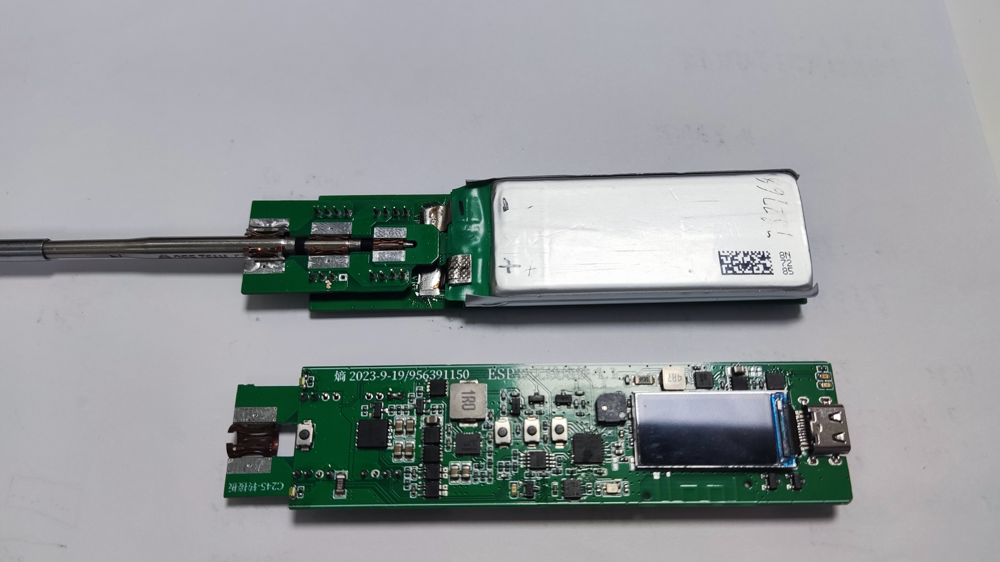

# ESP32-C245 Wireless Soldering Iron

#### Project Description
ESP32-C245 Wireless Soldering Iron is a portable wireless electric soldering iron powered by lithium battery. It uses C245 heating core, supports TYPE-C fast charging to directly power and charge lithium battery, supports real-time measurement and display of parameters such as soldering iron temperature, current, voltage, power, etc.

#### Function Introduction
1. Supports -100℃ ~ 450℃ temperature range measurement and temperature calibration function
2. Supports lithium battery power supply and TYPE-C dual power supply, automatically switches power supply and charges lithium battery
3. TYPE-C input power: 5~20V/5A PD fast charging deception power default: 65W
4. TYPE-C interface supports program download and fast charging deception power supply (through positive and reverse plug-in distinction function)
5. 3 common buttons for mode switching and parameter setting 1 reset button for burning program
6. ST7735 0.96 inch 160*80 pixel color LCD display to display various parameters
7. Support multiple function settings, save data when powered off, low power sleep 20uA and button wake-up
8. When powered by lithium battery, the maximum heating power is 20W, the heating speed is slightly slower, welding above 350℃ is more difficult, and the battery life is also relatively tight
9. When powered by TYPE-C, the maximum available heating power is 99W, and the current limit is adjustable

#### Project information
1. In August 2023, the schematic diagram, PCB design, proofing and verification function of ESP32 wireless soldering iron 1.0 were carried out
2. In September 2023, the schematic diagram, PCB design, proofing and verification function of ESP32 wireless soldering iron 1.1 were carried out
3. In October 2023, the shell structure design of ESP32 wireless soldering iron 1.1 was carried out and proofing was done by LiChuang 3D
4. In November 2023, the code was officially written and tested Solve some bugs and improve the hardware, software and structural shell design
5. The project has a total of 2 iterations, and it cost more than 600 yuan to make PCB proofing, shell 3D proofing and purchase components
6. This project is the first public, and it is an original CC BY-SA 4.0 open source project of Negative Entropy Light
7. LiChuang open source platform link: https://oshwhub.com/fj956391150/ESP32-wu-xian-lao-tie
8. Negative Entropy Light 2023-11-22

#### Design principle
1. This project uses ESP32-S3FN8 as the main control, and uses ADC to collect the soldering iron thermocouple temperature signal and current signal to control the PWM drive PMOS switch to control the soldering iron temperature and heating power
2. The HUSB238-002D chip is used for fast charging deception, but this chip does not support the fast charging protocol very well, and cannot deceive some chargers to output
3. TPS61088RHLR is used to boost the battery voltage of about 3.7V to 8V to power the soldering iron to increase the heating power
4. XB7608AJ is used to provide overvoltage, undervoltage, overcurrent, short circuit and other protection functions for lithium batteries. SLM6305 is used to charge lithium batteries
5. LIS3DHTR is used for motion detection to determine whether to enter deep sleep mode
6. GS8552 amplifier is used to amplify the soldering iron thermocouple temperature signal and current signal
7. Affected by the low-end current sampling circuit, the current will affect the soldering iron thermocouple temperature signal during operation. Therefore, intermittent sampling of thermocouple temperature signals is adopted and the temperature is obtained by table lookup

#### Function mode button
1. Constant temperature heating mode: short press K1 to switch between standby and working modes. Long press K1 to enter deep sleep mode. Short press K2 K3 to set the target temperature. Long press K2 K3 to switch between different modes
2. Function setting mode: short press K1 to switch between different function settings Long press K1 to enter and exit a more detailed parameter setting interface. Short press K2 K3 to turn the function on or off and set parameters plus or minus.
3. Calibration setting mode: Short press K1 to switch different calibration parameters. Long press K1 to enter and exit a more detailed parameter setting interface. Short press K2 K2 to subtract or add parameters and set them on or off.
4. Deep sleep mode: Short press K1 in deep sleep mode to wake up and enter the constant temperature heating mode interface. Long press K1 in the constant temperature heating mode interface to enter deep sleep mode.
#### Constant temperature heating mode
1. Short press K1 to switch between standby and working modes. Short press K2 K3 to set the target temperature. Long press K2 K3 to switch between different modes.
2. In standby mode, only measure the soldering iron temperature without heating. It can be used as a thermometer.
3. In operation, measure the soldering iron temperature and heat the soldering iron temperature to the set target temperature.
4. Set the target temperature range: -99℃~450℃
5. Soldering iron temperature measurement range: -200℃~450℃. The range and accuracy are affected by temperature calibration parameters.
6. When no movement is detected, the sleep time for entering deep sleep mode will be counted. When movement is detected, the timer will be reset.
7. When the lithium battery voltage is detected to be lower than 3.2V, it will enter deep sleep mode.

#### Function setting mode
1. Short press K1 to switch different function settings. Long press K1 to enter and exit a more detailed parameter setting interface. Short press K2 K3 to turn the function on or off, and add or subtract parameters.
2. Maximum current setting: Set the maximum heating current under different supply voltages to prevent excessive current from pulling the power supply.
3. Working mode setting: Default standard heating mode. Intelligent heating mode will automatically +50℃ for welding when a large solder joint is detected. It is not perfect at present.
4. Motion detection setting: Set the acceleration detection threshold.
5. Sleep time setting: Set the sleep timer from 1 to 60 minutes. Enter deep sleep mode after exceeding the time.
6. Screen orientation setting: By short pressing K2 K3 key to set screen direction
7. Auxiliary lighting setting: Set LED auxiliary lighting switch
8. Buzzer switch setting: Set whether the buzzer prompt tone is on or off
9. Restore default settings: Set parameter to 1 to restore the default values of all parameters and save

#### Calibration setting mode
1. Short press K1 key to switch different calibration parameters. Long press K1 key to enter and exit more detailed parameter setting interface. Short press K2 K2 to subtract or add parameters, turn on or off settings
2. Use an external accurate thermometer to measure the actual temperature of the soldering iron to adjust the set temperature value. Let the soldering iron be constant at the temperature to be calibrated and then press the calibration switch to save the corresponding soldering iron thermocouple voltage
3. When calibrating the voltage, the default calibration starts from 0℃. Put the soldering iron tip in the ice water mixture. Calibrate after a while and then calibrate step by step. 500℃ may exceed the range
4. It is best to use a professional thermometer for temperature calibration. The multimeter is unreliable. Calibration parameters below 0℃ are not calibrated under the conditions. The theoretical calculated value is written
5. The default calibration parameters are calibrated by a multimeter, which is not very accurate. The voltage of the soldering iron thermocouple of different manufacturers is likely to be different. Calibration is required before use.
6. In order to support the measurement of the temperature range of -100℃ ~ 450℃, the measurement accuracy of 0~ 450℃ is sacrificed.

#### Software Description
1. This program is developed based on Arduino IDE. The source program, dependent libraries and compiled burning files are in the attachment. Xiaobai recommends using the ESP official tool for burning.
2. Download and burn through the ESP official tool. You need to install esp32 flash_download_tool_3.9.5, call in the burning bin file, configure the corresponding parameters, download and restart.
3. Compile and download through Arduino IDE. You need to install esp32 development board and related libraries and select the corresponding chip parameter configuration. Installation package version: esp32_package_2.0.14
4. When the chip downloads the program for the first time, if there is no USB device, change the plug. If the USB does not recognize it, you need to pull down the P0 pin (press the K3 key) Then press the reset button to enter the forced download mode
5. After the forced download mode is successfully burned, you need to press the reset button to restart the program. If the screen does not display, press the button to see if there is a response. If there is a response, the screen does not light up. Enter the deep sleep mode and wake up.
6. If there is no response after the burning is successful, the screen does not display a black screen, etc., focus on checking the hardware welding and download parameter configuration. If there is an abnormal situation, you can re-burn the program.

#### Hardware assembly
1. EESP32-C245 wireless soldering iron consists of: main control PCBA + adapter board PCBA + lithium battery + shell + C245 soldering iron core
2. The main control PCB and adapter board PCB use ordinary RF-4 material 2-layer board with a thickness of 0.8mm. The two boards are welded together through the pin header. Pay attention to the direction not to weld in reverse
3. The adapter board PCBA needs to be welded with 3 types of beryllium bronze crown springs O4.5-8mm / K10#-8 / K16#-6 each. See the picture for details Note that ventilated beryllium bronze welding is toxic
4. The shell is designed using SOLIDWORKS 2021. There are two similar solutions, large and small, which can be used interchangeably. There is only a slight difference in appearance. You can choose any one to use
5. The lithium battery is recommended to use R&F 782768SV aircraft model battery cell with a capacity of 1750mAh, length 68*width 27*height 7.2mm. See the picture for details. As long as the parameters are suitable, other models can also be used
6. TFT uses ST7735 0.96-inch 160*80 pixel color LCD display screen, welding type 13PIN interface. Note that ST7735 must be used. ST7735S may not display
7. The C245 soldering iron core uses the C245-SK small knife head soldering iron core of Sugong

#### Notes
1. This project is a CC BY-SA 4.0 open source project. If you need large-scale commercial use, you must find the original author for authorization
2. This project uses a large number of 0402 package components, which is difficult to hand solder Or use Jiali Chuang SMT. The project is more difficult, so please do your best to reproduce it.
3. When welding the model aircraft battery, it is recommended to discharge the voltage to 3.3V before welding. Do not weld the positive and negative poles in reverse, otherwise magic smoke will be released.
4. For 3D printed shells, try to use materials with high printing precision for large shells and high temperature resistant materials for small shells close to the heating end.
5. Some parameters may be abnormal for the first use. It is recommended to restore the default settings.
6. Abnormal software control of PWM drive constant current function will cause excessive current to pull down the power supply. Try to use a high-power power supply to avoid this problem.
7. When welding high-temperature large pads, the maximum 20W heating power of the lithium battery may not be enough. It is recommended to use a high-power power supply.
8. The component parameters are based on the schematic diagram. If it is not available in Lichuang Mall, go to Taobao. The relevant software and hardware information are in the attachment. The schematic diagram has relevant information.
9. This project is only a personal DIY project. It has not been professionally evaluated and tested. There may be hidden bugs. It is not perfect yet. Be cautious in reproducing and using it. Risks are borne by yourself.

#### Physical display

